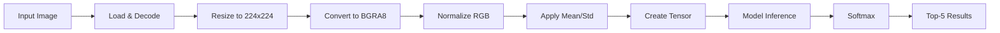

# WinML Lab Demo

A comprehensive Windows Machine Learning (WinML) demonstration application that showcases ONNX model inference across different execution providers and hardware accelerators.

## 🎯 Overview

This WPF application demonstrates how to deploy and optimize machine learning models on Windows using various execution providers. It features a user-friendly interface for managing execution providers, compiling models for specific hardware, and running image classification with real-time performance metrics.

## ✨ Features

### 🖥️ **Execution Provider Management**
- **Dynamic EP Discovery**: Automatically detects available execution providers
- **Hardware Acceleration**: Support for CPU, GPU, and specialized AI accelerators
- **EP Initialization**: Download and register WinML execution providers
- **Real-time Status**: Live monitoring of EP availability and capabilities

### 🖼️ **Image Classification**
- **Multi-format Support**: JPG, PNG, BMP image formats
- **Live Preview**: Real-time image preview with automatic resizing
- **Batch Processing**: Process multiple images sequentially
- **Top-5 Results**: Display confidence scores for top predictions

### ⚡ **Model Optimization**
- **Hardware-Specific Compilation**: Compile ONNX models for target hardware
- **Performance Tuning**: Optimize for different execution providers
- **Memory Management**: Efficient model loading and session management

### 📊 **Performance Monitoring**
- **Real-time Metrics**: Inference time, compilation time, loading time
- **Console Logging**: Detailed operation logs with timestamps
- **Error Handling**: Comprehensive error reporting and recovery

## 🏗️ Architecture

### Core Components

```
WinMLLabDemo/
├── MainWindow.xaml/.cs          # Main UI and event handling
├── ExecutionLogic.cs            # ML runtime and EP management
├── ModelHelpers.cs              # Image processing and model utilities
├── SqueezeNet.onnx             # Pre-trained image classification model
├── SqueezeNet.Labels.txt       # 1000 ImageNet class labels
└── image.jpg, image2.png       # Sample test images
```

### Execution Providers Supported

| Provider | Description | Use Case |
|----------|-------------|----------|
| **CPUExecutionProvider** | CPU-based inference | Universal compatibility |
| **DmlExecutionProvider** | DirectML GPU acceleration | Windows GPU optimization |
| **OpenVINOExecutionProvider** | Intel OpenVINO optimization | Intel CPU/GPU acceleration |
| **QNNExecutionProvider** | Qualcomm Neural Network | Snapdragon AI acceleration |
| **VitisAIExecutionProvider** | Xilinx Vitis AI | FPGA acceleration |
| **NvTensorRTRTXExecutionProvider** | NVIDIA TensorRT | NVIDIA GPU optimization |

## 🚀 Getting Started

### Prerequisites

- **Windows 10/11** (version 10.0.26100.0 or later)
- **.NET 8.0** or later
- **Visual Studio 2022** (recommended) or VS Code
- **Windows App SDK** (included in project)

### Installation

1. **Clone the repository**
   ```bash
   git clone <repository-url>
   cd WinMLLabDemo
   ```

2. **Build the project**
   ```bash
   dotnet build
   ```

3. **Run the application**
   ```bash
   dotnet run
   ```

### First Run Setup

1. **Launch the application**
2. **Initialize WinML EPs** (if not already done)
   - Click "Initialize WinML EPs" button
   - Wait for download and registration to complete
3. **Select an execution provider** from the left panel
4. **Choose a sample image** or browse for your own
5. **Compile the model** for your selected EP (if needed)
6. **Load the model** and run classification

## 📖 Usage Guide

### Step-by-Step Workflow

#### 1. **Execution Provider Setup**
```
┌─────────────────────────────────────┐
│ Execution Providers                 │
├─────────────────────────────────────┤
│ [Refresh List] [Initialize WinML]  │
│                                     │
│ ┌─────────┬─────────┬─────────────┐ │
│ │ Name    │ Vendor  │ Device Type │ │
│ ├─────────┼─────────┼─────────────┤ │
│ │ CPU EP  │ ONNX    │ CPU         │ │
│ │ DML EP  │ MS      │ GPU         │ │
│ └─────────┴─────────┴─────────────┘ │
└─────────────────────────────────────┘
```

#### 2. **Image Selection**
- Click "Browse..." to select an image file
- Supported formats: JPG, PNG, BMP
- Preview appears automatically
- Sample images included: `image.jpg`, `image2.png`

#### 3. **Model Operations**
```
┌─────────────────────────────────────┐
│ [Compile Model] [Load Model] [Run] │
└─────────────────────────────────────┘
```

- **Compile Model**: Optimizes ONNX model for selected EP
- **Load Model**: Loads compiled model into memory
- **Run Classification**: Executes inference and displays results

#### 4. **Results Display**
```
Top Predictions:
-------------------------------------------
Label                              Confidence
-------------------------------------------
golden retriever                      95.23%
Labrador retriever                    3.45%
tennis ball                           1.12%
-------------------------------------------
```

### Advanced Features

#### **Performance Optimization**
- **Threading Configuration**: OpenVINO EP supports custom thread count
- **Performance Mode**: QNN EP supports high-performance mode
- **Memory Management**: Automatic cleanup of inference sessions

#### **Error Handling**
- **Graceful Degradation**: Falls back to CPU if GPU unavailable
- **Detailed Logging**: Comprehensive error messages in console
- **Recovery Options**: Automatic retry mechanisms

## 🔧 Technical Details

### Machine Learning Model

- **Model**: SqueezeNet v1.1
- **Architecture**: Lightweight CNN optimized for mobile/edge
- **Input Size**: 224×224×3 (RGB)
- **Output**: 1000-class classification (ImageNet)
- **Model Size**: ~5MB (compressed)

### Image Processing Pipeline



### Performance Characteristics

| Execution Provider | Typical Latency | Memory Usage | Optimization |
|-------------------|-----------------|--------------|--------------|
| CPU EP | 50-200ms | Low | Baseline |
| DML EP | 10-50ms | Medium | GPU acceleration |
| OpenVINO EP | 20-80ms | Low | Intel optimization |
| QNN EP | 5-30ms | Low | Snapdragon AI |
| TensorRT EP | 5-25ms | High | NVIDIA optimization |

## 🛠️ Development

### Project Structure

```
WinMLLabDemo/
├── App.xaml/.cs                    # Application entry point
├── MainWindow.xaml/.cs             # Main UI and event handling
├── ExecutionLogic.cs               # Core ML operations
├── ModelHelpers.cs                 # Image processing utilities
├── AssemblyInfo.cs                 # Assembly metadata
├── SqueezeNet.onnx                # Pre-trained model
├── SqueezeNet.Labels.txt          # Class labels
├── image.jpg                       # Sample image 1
├── image2.png                      # Sample image 2
└── WinMLLabDemo.csproj            # Project configuration
```

### Key Dependencies

```xml
<PackageReference Include="Microsoft.WindowsAppSDK" Version="1.8.250702007-experimental4" />
```

### Build Configuration

- **Target Framework**: .NET 8.0-windows10.0.26100.0
- **Platforms**: win-x86, win-x64, win-arm64
- **UI Framework**: WPF (Windows Presentation Foundation)
- **ML Runtime**: ONNX Runtime with WinML integration

### Development Setup

1. **Install Visual Studio 2022** with .NET desktop development workload
2. **Clone and open** the solution in Visual Studio
3. **Restore NuGet packages**
4. **Build and run** the project

## 🧪 Testing

### Sample Images
- `image.jpg`: Microsoft Azure branding image
- `image2.png`: Additional test image

### Expected Results
When running classification on the sample images, you should see:
- **Top predictions** with confidence scores
- **Performance metrics** in console output
- **Real-time logging** of operations

### Performance Testing
1. **Baseline**: Run with CPU EP for comparison
2. **GPU Testing**: Test with DML EP for acceleration
3. **Specialized Hardware**: Test with vendor-specific EPs
4. **Memory Monitoring**: Check console for memory usage

## 🔍 Troubleshooting

### Common Issues

#### **"No execution providers found"**
- **Solution**: Click "Initialize WinML EPs" button
- **Check**: Windows version compatibility
- **Verify**: .NET 8.0 installation

#### **"Model compilation failed"**
- **Solution**: Ensure sufficient disk space
- **Check**: EP compatibility with your hardware
- **Verify**: ONNX model file integrity

#### **"Image loading error"**
- **Solution**: Check file format and path
- **Supported**: JPG, PNG, BMP formats
- **Verify**: File permissions and accessibility

#### **"Inference timeout"**
- **Solution**: Try CPU EP as fallback
- **Check**: Hardware compatibility
- **Verify**: Model compilation success

### Debug Information

Enable detailed logging by checking console output for:
- **EP initialization status**
- **Model compilation progress**
- **Inference timing metrics**
- **Memory usage statistics**

## 📚 Learning Resources

### WinML Documentation
- [Windows Machine Learning Overview](https://docs.microsoft.com/en-us/windows/ai/)
- [ONNX Runtime Documentation](https://onnxruntime.ai/)
- [DirectML Documentation](https://docs.microsoft.com/en-us/windows/win32/directml/)

### Related Technologies
- **ONNX**: [Open Neural Network Exchange](https://onnx.ai/)
- **SqueezeNet**: [Model Architecture Paper](https://arxiv.org/abs/1602.07360)
- **ImageNet**: [Dataset Information](https://image-net.org/)

### Development Resources
- [WPF Documentation](https://docs.microsoft.com/en-us/dotnet/desktop/wpf/)
- [.NET 8 Documentation](https://docs.microsoft.com/en-us/dotnet/)
- [Windows App SDK](https://docs.microsoft.com/en-us/windows/apps/windows-app-sdk/)

## 🤝 Contributing

### Development Guidelines
1. **Follow existing code style** and patterns
2. **Add comprehensive error handling** for new features
3. **Update documentation** for any API changes
4. **Test across different execution providers**
5. **Include performance metrics** for optimizations

### Testing Checklist
- [ ] Test with all supported execution providers
- [ ] Verify image processing pipeline
- [ ] Check memory usage patterns
- [ ] Validate error handling scenarios
- [ ] Test performance on different hardware

## 📄 License

This project is licensed under the MIT License - see the [LICENSE](LICENSE) file for details.

## 🙏 Acknowledgments

- **Microsoft WinML Team** for the Windows Machine Learning framework
- **ONNX Runtime Team** for the cross-platform ML runtime
- **SqueezeNet Authors** for the lightweight CNN architecture
- **ImageNet Team** for the comprehensive image classification dataset

---

**Note**: This demo application is designed for educational and development purposes. For production use, consider additional security, performance, and reliability requirements. 